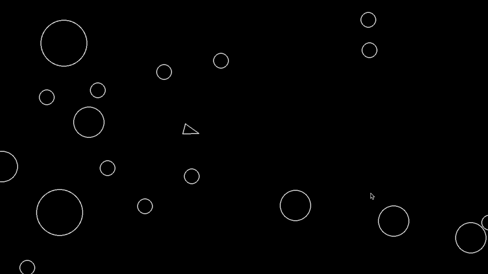

# Asteroids

A classic arcade-inspired space shooter built with Python and Pygame.



## Technologies Used

- Python 3.13
- Pygame 2.6
- uv

## Project Structure

```
asteroids/
├── main.py            # Game loop and initialization
├── constants.py       # Global configuration values
├── circleshape.py     # Base class for all circular game objects
├── player.py          # Player ship logic and controls
├── asteroid.py        # Asteroid behavior and rendering
├── asteroidfield.py   # Procedural asteroid spawning
└── pyproject.toml     # Project dependencies and metadata
```

## Installation

```
git clone https://github.com/CaesarBrahh/asteroids.git
cd asteroids
uv sync
uv run main.py
```

## Controls

- W - Thrust forward
- A - Rotate left
- S - Thrust backwards
- D - Rotate right
